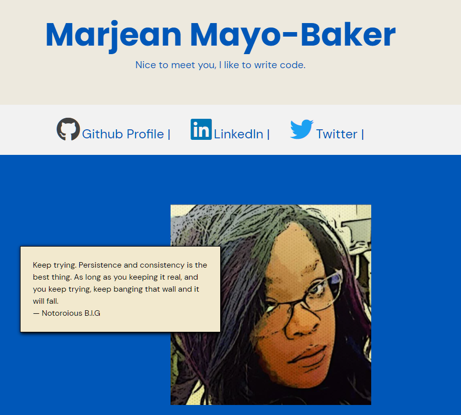

# Marjean Portfolio page

## Table of contents

- [Overview](#overview)
  - [The challenge](#the-challenge)
  - [Screenshot](#screenshot)
  - [Links](#links)
- [My process](#my-process)
  - [Built with](#built-with)
  - [What I learned](#what-i-learned)
  - [Continued development](#continued-development)
  - [Useful resources](#useful-resources)
- [Author](#author)

## Overview

### The challenge

Users should be able to:

- View an overview of my projects and read my background story.

### Screenshot



### Links

- Live Site URL: [https://marjeanm.github.io/portfolio/](https://marjeanm.github.io/portfolio/)

## My process

### Built with

- Semantic HTML5 markup
- CSS custom properties
- Flexbox
- Javascript

### What I learned

I learned how to color font-awesome icons and hover states on nav iteams.
also, i learned how to use position relative to move divs to a desired position.
Javascrip on how to to use getBoundingClientRect and window scroll to use smooth scroll.
How to use HTML (api) to make the contact form work

This Css below sets up the smooth scroll that is written javascript.

```css
html {
  scroll-behavior: smooth;
}
```

This is below the code i used when you click on the nav links it will scroll to correct section

```js
/*smooth scroll*/
const arrow = document.querySelectorAll('.scroll-link');
for (const arrows of arrow) {
  arrows.addEventListener('click', function (e) {
    e.preventDefault();
    const id = e.currentTarget.getAttribute('href');
    console.log(id);
    const element = document.getElementById(id);
    console.log(element);
    let position = element.offsetTop;
    console.log(position);
    window.scrollTo({
      left: 0,
      top: position,
    });
  });
}
```

This is also is the HTML form for submitting for email.

```html
<form action="https://formsubmit.co/marjean_m@hotmail.com" method="POST">
  <label for="fname"> Name</label>
  <input type="text" placeholder=" Name" name="name" id="name" />

  <label for="Email">Your Email</label>
  <input type="email" id="email" placeholder="Email" name="email" />

  <label for="message"> Message</label>
  <textarea
    placeholder="Your Message"
    name="message"
    id="message"
    cols="30"
    rows="10"
  ></textarea>

  <hr />
  <button type="submit" class="btn">submit</button>
</form>
```

### Continued development

Plans i have are to create a transistion bottom border on top nav items

### Useful resources

- [MDN](https://developer.mozilla.org/en-US/) - This is a great source for people starting out. Also, helps with looking up solutions and reworking your code.

## Author

- Website - [Marjean Mayo-Baker](https://marjeanm.github.io/portfolio/)
- Frontend Mentor - [@marjeanm](https://www.frontendmentor.io/profile/marjeanm)
- Twitter - [@Matty_Mayonaise](https://www.twitter.com/Matty_Mayonaise)
